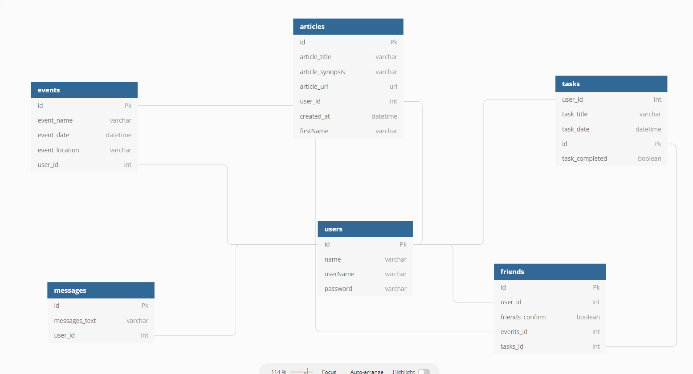

# Nutshell: The Information Dashboard for 'Bangazon' Employees

Group Project:

- [Chandler](https://github.com/jchandlerturner)
- [Gradi Ellis](https://github.com/geellis1)
- [Fortunato Mugnano](https://github.com/FortunatoMugnano)
- [Seth Oakley](https://github.com/sethoak)
- [Summer Liddington](https://github.com/summerliddington)

## Setup: Follow these steps exactly

1. Clone this repository
1. `cd` into the directory it creates
1. Make a `database.json` file in the `api` directory
1. Run `npm install` and wait for all dependencies to be installed
1. Run `npm start` to verify that installation was successful.

## Skills Implemented

1. Functions
1. Databases/API
1. Github
1. Objects
1. CSS/Flexbox
1. Array methods
1. Handling user events
1. Factory functions
1. Implementing CRUD operations
1. Modular code with Webpack
1. Relational data

### Database Diagram

